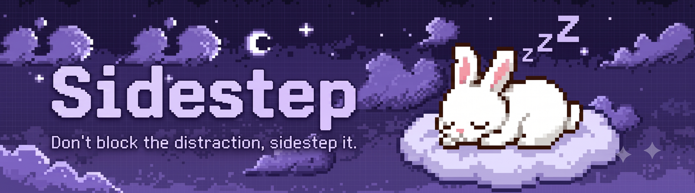

<p align="center">
  
</p>

<h1 align="center">Sidestep</h1>

<p align="center">
  <strong>A gentle Chrome focus tool. It doesn't wall off distracting sites — it pauses them, catches the thought underneath, and keeps you company while you work.</strong>
</p>

<p align="center">
  
  
  
  
</p>

---

## 🚀 Try it in 30 seconds (no build needed)

This repo ships a **ready-to-load, pre-built copy** of the extension in the [`load-unpacked/`](load-unpacked/) folder. Judges and reviewers can run it straight away:

1. Download or clone this repo.
2. Open **`chrome://extensions`** in Chrome (or Edge / Brave).
3. Turn on **Developer mode** (toggle, top-right).
4. Click **Load unpacked** and select the **`load-unpacked/`** folder.
5. Pin the 🌱 Sidestep icon, click it, and hit **Start**.

> To see the block page, add a site (Blocked tab), start a focus session, then visit that site. Refresh any tab you want the on-page companion to appear in — content scripts only inject into pages opened *after* the extension loads.

---

## 💡 The idea in one line

Every website blocker throws away the most valuable moment of your work session — the moment you get distracted. **Sidestep catches it instead.**

When you reach for a distracting site mid-task, there's almost always a real thought underneath ("reply to Sam", "look up that error"). A blocker deletes that thought, so your brain keeps rehearsing it — which is what actually drags you off task. Sidestep replaces the wall with a calm pause that **captures the thought**, shows you the sites you chose to protect, and offers an honest way through if you genuinely need it.

> No streak to break. No health bar to drain. Nothing dies if you have a bad day. Every number only goes up.

---

## 👥 Who it's for

Students and anyone doing long stretches of solo work — and it's designed around how focus actually breaks down for people with ADHD traits or anxiety, where harsh blockers backfire and turn a bad afternoon into a shame spiral. So nothing here punishes you; it supports you.

---

## ✨ What's inside

| | Feature | What it does |
|:--:|---|---|
| ⏱️ | **Focus timer** | A focus/break Pomodoro that keeps running in the background even with the popup closed — and shows the minutes left right on the toolbar icon. |
| 🛑 | **The pause page** | Reach for a blocked site mid-session and you land on a calm page, not a wall: jot the thought, see everything you've parked, see the sites you're protecting, and take an honest way through. |
| 🗒️ | **Thought parking lot** | Capture the stray thought that pulled you away so your brain stops rehearsing it. It waits safely in the popup for *after* the session. This is the core mechanism. |
| 🕊️ | **Freedom window** | Genuinely need a blocked site? Allow just that one for 5 / 15 / 30 minutes (or no limit). Every other site stays protected; it closes itself when time's up. |
| 🐾 | **Companion pet** | A pixel pet runs while you focus and rests when you rest — a *body-double*, a real focus technique. It naps on the pause page too. |
| ⭐ | **XP & unlocks** | Focused minutes earn XP that unlocks new companions (a fox, then a cat). XP never falls, so a bad week can't take a friend away. |
| 🎨 | **Scene themes** | Meadow, Autumn, and Rainy — the whole interface recolours to match the mood you pick. |
| 🔒 | **Local & private** | Everything lives in your browser's local storage. No account, no server, no analytics — the extension has no permission to talk to any server, and works fully offline. |

---

## 🎬 How it feels

1. You start a focus session. A little companion begins running alongside you, and the toolbar icon counts down the minutes.
2. Ten minutes in, your hand drifts to YouTube out of habit.
3. Instead of YouTube, the tab lands on a **calm pause page** that asks *"Was there something you meant to do there?"* — with your parked thoughts and protected sites below.
4. You jot the thought down and carry on. If you genuinely need the site, you grant it a timed pass. The thought is waiting in the popup for later.

No guilt screen. No "you failed." Just a gentle catch and a nudge back.

---

## 🛠️ Built with

- **[WXT](https://wxt.dev/)** — a modern toolkit for building browser extensions (handles the build and the manifest).
- **[Svelte 5](https://svelte.dev/)** — the UI framework for the popup and the pause page (using runes).
- **Chrome Manifest V3** — background *service worker*, storage, alarms, webNavigation.

Two problems were genuinely hard, and they're the interesting ones:

- **The timer can't be a countdown.** In Manifest V3 the background worker is killed after ~30s idle, so a normal `setInterval` dies with it. The timer instead stores an *end timestamp* and wakes itself with Chrome alarms — it's correct even though nothing is running most of the time.
- **YouTube never actually loads a page.** It's a single-page app; clicking a video rewrites the URL without a page load. Sidestep listens to history-state changes as well, so it catches the video you click, not just the homepage you type.

---

## 📂 Repository layout

```
HackWave/
├─ load-unpacked/     ⭐ the ready-to-load, pre-built extension — point Chrome here
├─ source/            the source code (WXT + Svelte 5)
│  ├─ public/         companion sprites + scene art (bunny, fox, cat, scenes)
│  └─ src/
│     ├─ entrypoints/
│     │  ├─ popup/        the toolbar popup (timer, companion, themes, settings)
│     │  ├─ nudge/        the calm pause page
│     │  └─ background.ts the service worker: owns the timer + site blocking
│     └─ lib/
│        ├─ storage.js    what we save (settings, timer, thoughts, allowances)
│        ├─ sites.js      URL rules: is this host distracting? domain matching
│        └─ timer.js      pure, timestamp-based timer logic
├─ docs/              ARCHITECTURE.md, PLAN.md, demo notes
├─ assets/            banner, icon, design art
└─ README.md
```

> `load-unpacked/` is a **snapshot** of a production build (`source/.output/chrome-mv3/`), committed so the extension runs without a build step. Rebuild it any time with the steps below.

---

## 🧑‍💻 Build from source

You'll need [Node.js](https://nodejs.org/) (it comes with `npm`).

```bash
cd source
npm install       # install the libraries the project depends on
npm run build     # produces source/.output/chrome-mv3/
```

Load `source/.output/chrome-mv3/` the same way as `load-unpacked/` above. For live development with auto-reload, run `npm run dev` instead of `npm run build`.

---

## 🗺️ Where it's headed

- [x] Focus timer that survives the MV3 service-worker sleeping, with a live toolbar countdown
- [x] Calm pause page: thought parking, protected-site view, freedom window
- [x] Companion pet with XP unlocks (fox, cat) — additive only, never lost
- [x] Three recolouring scene themes
- [x] Sleep-aware: laptop sleep pauses the session, a browser close resets it
- [ ] Session wrap-up: a gentle, additive-only "win log" (focused minutes, thoughts parked)
- [ ] Opt-in cross-device sync
- [ ] Firefox build

---

<p align="center">
  <sub>Built with 💜 for <strong>HackWave 2026</strong> · A supportive productivity tool, not a medical or clinical product.</sub>
</p>
